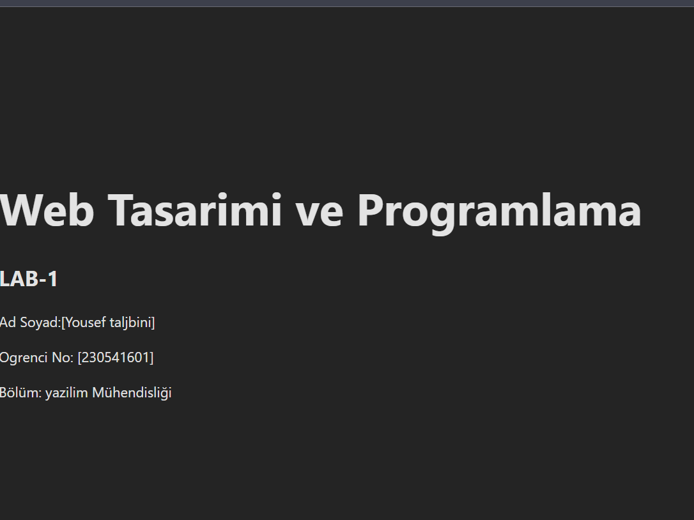

# Web LAB-1


## Hakkinda

Bu proje, Web Tasarimi ve Programlama dersi LAB-1 kapsaminda Vite + React + TypeScript kullanilarak olusturulmustur.


## Gelistirici

**Ad Soyad:**Yosuef Taljbini

**Ogrenci No:** 230541601


## Kullanilan Teknolojiler

- React 18

- TypeScript

- Vite


## Kurulum

```bash

npm install

```

## Calistirma

npm run dev


 ```

25 Tarayicida http://localhost:5173 adresini ac.

```
## Ekran Goruntusu
